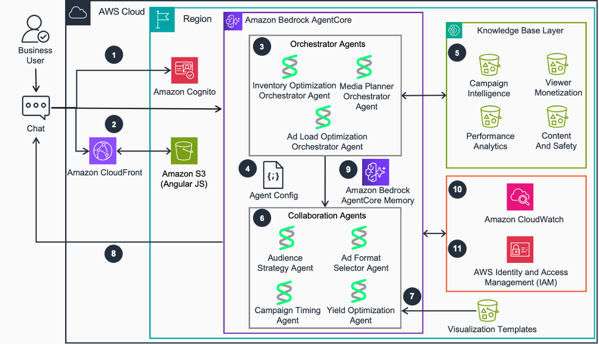
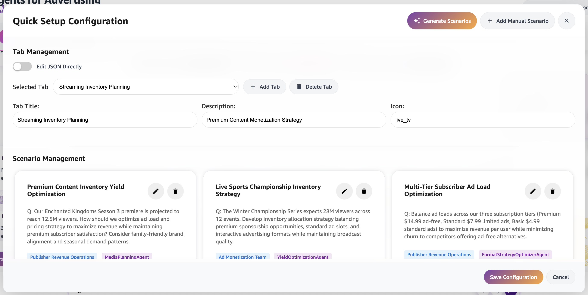
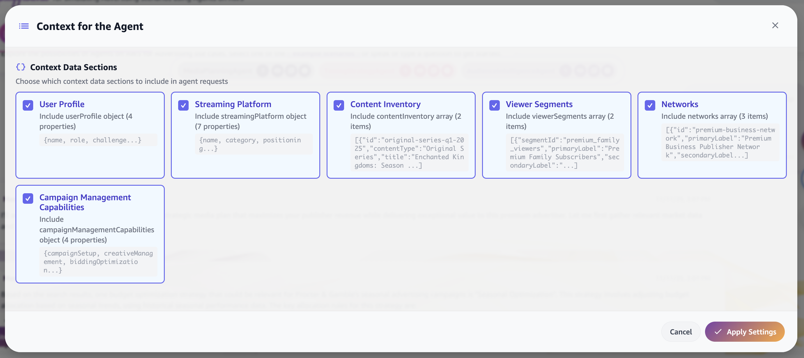
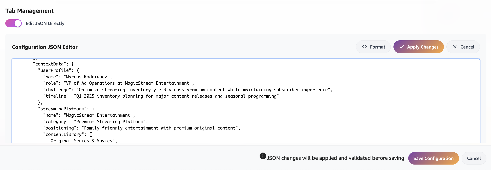
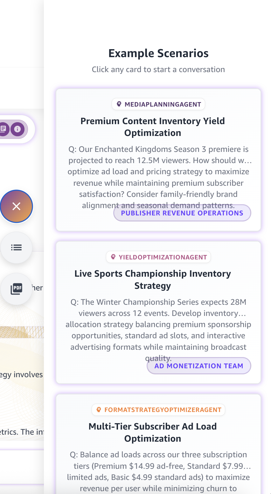
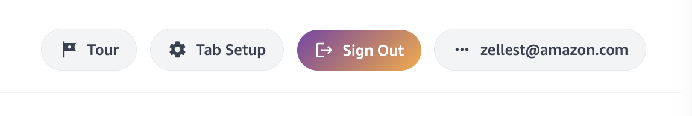

# Guidance for Advertising Agents

This guidance demonstrates how to deploy a comprehensive agentic application for advertising workflows using Amazon Bedrock AgentCore. The solution showcases advanced multi-agent collaboration across the entire advertising value chain - from strategic media planning and audience targeting to real-time bid optimization and publisher revenue management.

## Table of Contents 

1. [Overview](#overview)
    - [Architecture](#architecture)
    - [Cost](#cost)
2. [Prerequisites](#prerequisites)
    - [Operating System](#operating-system)
    - [AWS Account Requirements](#aws-account-requirements)
    - [Service Limits](#service-limits)
    - [Supported Regions](#supported-regions)
3. [Deployment Steps](#deployment-steps)
4. [Deployment Validation](#deployment-validation)
5. [Running the Guidance](#running-the-guidance)
6. [Customizing the Demo](#customizing-the-demo)
7. [Next Steps](#next-steps)
8. [Cleanup](#cleanup)
9. [FAQ, known issues, additional considerations, and limitations](#faq-known-issues-additional-considerations-and-limitations)
10. [Notices](#notices)
11. [Authors](#authors)

## Overview 

This guidance demonstrates how to deploy a comprehensive agentic application for advertising workflows using Amazon Bedrock AgentCore. The solution showcases advanced multi-agent collaboration across the entire advertising value chain - from strategic media planning and audience targeting to real-time bid optimization and publisher revenue management.


**Advertising Industry Challenge**
Modern advertising requires intelligent coordination across multiple specialized domains:
- **Strategic Media Planning**: Campaign strategy, audience targeting, channel mix optimization, and campaign architecture
- **Tactical Bid Optimization**: Brand safety analysis, contextual targeting, bid optimization, and creative selection with AI image generation
- **Publisher Monetization**: Ad load optimization, inventory forecasting, campaign timing, and revenue format selection

This guidance provides an agentic solution that delivers:
- **Multi-Agent Application**: 21+ specialized AI agents with intelligent orchestration across 4 orchestrator agents and 17+ specialist agents
- **AgentCore Container Runtime**: All agents deployed using Amazon Bedrock AgentCore for enhanced capabilities including persistent memory, multi-agent coordination, and external API integration
- **Interactive Demo Interface**: Angular-based UI with real-time agent collaboration visualization
- **Cost-Optimized Model Assignment**: Intelligent foundation model selection based on task complexity
- **Real-Time Creative Generation**: Amazon Nova Canvas integration for dynamic image creation

### Architecture



**Key Architecture Components:**
- **4 Orchestrator Agents**: Media Planning, Campaign Optimization, Yield Optimization, and Inventory Optimization
- **17+ Specialist Agents**: Audience Intelligence, Audience Strategy, Timing Strategy, Format Strategy, Channel Mix, Campaign Architecture, Creative Selection, Ad Load Optimization, Media Plan Compiler, Weather Impact, Current Events, Contextual Analysis, Bid Optimization, Bid Simulator, Ad Format Selector, Events, and more
- **1 Knowledge Base**: With 1 data source covering campaign intelligence, audience strategy, brand and content safety, performance analytics, and inventory & yield optimization across multiple subdirectories
- **Shared Memory System**: Unified context across all agents enabling sophisticated cross-domain decision making
- **External API Integration**: Real-time data from weather services, social media platforms, and competitive intelligence feeds

### Cost 

_You are responsible for the cost of the AWS services used while running this Guidance. As of October 2025, the cost for running this Guidance with the default settings in the US East (N. Virginia) region is approximately $329.86 per month, assuming daily usage (see cost breakdown for details)._

The AgentCore deployment model provides cost advantages through:
- **Pay-per-use container runtime**: Only pay when agents are actively processing requests
- **Shared infrastructure**: Multiple agents share the same AgentCore runtime reducing overhead
- **Optimized model usage**: Intelligent foundation model assignment (Claude Sonnet 4.5 for orchestrators, Claude Sonnet 4.0 or the possibility to switch to Claude 4.5 Haiku for specialists)
- **Dynamic scaling**: Container-based agents scale automatically based on demand

_We recommend creating a [Budget](https://docs.aws.amazon.com/cost-management/latest/userguide/budgets-managing-costs.html) through [AWS Cost Explorer](https://aws.amazon.com/aws-cost-management/aws-cost-explorer/) to help manage costs. Prices are subject to change. For full details, refer to the pricing webpage for each AWS service used in this Guidance._

### Sample Cost Table 

The following table provides a sample cost breakdown for deploying this Guidance with the default parameters in the US East (N. Virginia) Region for one month.

| AWS service | Dimensions | Monthly Cost [USD] |
| ----------- | ------------ | ------------ |
| Amazon Bedrock Foundation Models | average 4 conversation turns per session, average 6 LLM prompts per conversation turn at $0.003 per prompt, average 1.5 sessions a day | $19.44 |
| Amazon Bedrock AgentCore Runtime | AgentCore Runtime, AgentCore Memory, average session duration of 45 minutes | $16.61 |
| Amazon S3 | Knowledge base data storage (5GB), generated content, static hosting | $2.50 |
| Amazon OpenSearch Serverless | Knowledge base, vector search operations | $219.00 |
| AWS Lambda | image generation | $1.50 |
| Amazon DynamoDB | Generated content details | $70.31 |
| AWS CloudFront | Global content delivery for demo interface | $0.50 |
| **Total** | | **~$329.86** |

## Prerequisites 

### Operating System 

These deployment instructions are optimized to work on **Amazon Linux 2023 AMI**, **Ubuntu 20.04+**, and **macOS**. Deployment on other operating systems may require additional steps.

**Required packages:**
- **Python 3.10+** for deployment automation scripts (automatically managed by deployment script)
- **AWS CLI 2.0+** configured with appropriate permissions
- **Docker 20.10+** for AgentCore container builds (optional - only needed for custom agent development)
- **Node.js 22+** (LTS) for Angular demo UI (optional - only needed for UI development)
- **jq** for JSON processing (auto-installed by deployment script if missing)

**Install commands for Amazon Linux 2023:**
```bash
# Update system
sudo yum update -y

# Install Python 3.10+ (usually pre-installed)
sudo yum install -y python3 python3-pip python3-venv

# Install AWS CLI v2
curl "https://awscli.amazonaws.com/awscli-exe-linux-x86_64.zip" -o "awscliv2.zip"
unzip awscliv2.zip
sudo ./aws/install

# Install Docker (optional - for custom agent development)
sudo yum install -y docker
sudo systemctl start docker
sudo systemctl enable docker
sudo usermod -a -G docker $USER

# Install Node.js (optional - for UI development)
curl -fsSL https://rpm.nodesource.com/setup_22.x | sudo bash -
sudo yum install -y nodejs
```

**Install commands for Ubuntu:**
```bash
# Update system
sudo apt update && sudo apt upgrade -y

# Install Python 3.10+ and venv
sudo apt install -y python3 python3-pip python3-venv

# Install AWS CLI v2
curl "https://awscli.amazonaws.com/awscli-exe-linux-x86_64.zip" -o "awscliv2.zip"
unzip awscliv2.zip
sudo ./aws/install

# Install Docker (optional)
sudo apt install -y docker.io
sudo systemctl start docker
sudo systemctl enable docker
sudo usermod -a -G docker $USER

# Install Node.js (optional)
curl -fsSL https://deb.nodesource.com/setup_22.x | sudo -E bash -
sudo apt install -y nodejs
```

**Install commands for macOS:**
```bash
# Install Homebrew if not already installed
/bin/bash -c "$(curl -fsSL https://raw.githubusercontent.com/Homebrew/install/HEAD/install.sh)"

# Install required packages
brew install python@3.12 awscli jq

# Install Docker Desktop (optional)
brew install --cask docker

# Install Node.js (optional)
brew install node@22
```

### AWS Account Requirements

This deployment requires the following AWS account setup:

**Required AWS Services:**
- **Amazon Bedrock AgentCore** runtime enabled in your region
- **Amazon Bedrock Foundation Models** access (Claude Sonnet 4, Claude Sonnet 4.5, Nova Canvas)
- **Amazon Bedrock Knowledge Bases** for vector search capabilities
- **Amazon S3** for data storage, static hosting, and generated content
- **Amazon OpenSearch Serverless** for knowledge base vector search
- **AWS Lambda** for action groups and configuration management
- **Amazon DynamoDB** for configuration data and session management
- **Amazon ECR** for container image storage
- **AWS CloudFront** for global content delivery
- **AWS Cognito** for user authentication

**Required IAM Permissions:**
The deployment user/role needs comprehensive permissions. Here's the minimum required policy:

```json
{
    "Version": "2012-10-17",
    "Statement": [
        {
            "Effect": "Allow",
            "Action": [
                "bedrock:*",
                "bedrock-agent:*",
                "bedrock-agentcore:*",
                "s3:*",
                "opensearch:*",
                "lambda:*",
                "dynamodb:*",
                "ecr:*",
                "cloudfront:*",
                "cognito-idp:*",
                "iam:CreateRole",
                "iam:DeleteRole",
                "iam:AttachRolePolicy",
                "iam:DetachRolePolicy",
                "iam:PassRole",
                "iam:GetRole",
                "iam:ListRolePolicies",
                "iam:ListAttachedRolePolicies",
                "cloudformation:*",
                "ssm:GetParameter",
                "ssm:PutParameter",
                "ssm:DeleteParameter"
            ],
            "Resource": "*"
        }
    ]
}

```

### Service Limits

**Critical service limits that may require increases:**
- **Amazon Bedrock AgentCore**: Default limit of 10 concurrent containers per region (may need increase for large deployments)
- **Amazon Bedrock Foundation Models**: 
  - Claude Sonnet 4.5 v2: 40,000 tokens/minute (recommended for orchestrator agents)
  - Claude 4 Sonnet: 40,000 tokens/minute (recommended for specialist agents)
  - Nova Canvas: 5 images/minute (for creative generation)
- **Amazon OpenSearch Serverless**: Default limit of 50 collections per account
- **AWS Lambda**: Concurrent execution limit (default 1,000)
- **Amazon S3**: No specific limits for this use case
- **Amazon DynamoDB**: Default limits are sufficient for this guidance

**To request limit increases:**
1. Navigate to [AWS Service Quotas](https://console.aws.amazon.com/servicequotas/)
2. Search for the specific service and quota
3. Submit increase request with business justification
4. For Bedrock model access, use the Bedrock console → Model access page

### Supported Regions

This Guidance is optimized for regions with full Amazon Bedrock AgentCore support:
- **US East (N. Virginia)** - us-east-1 (Recommended - most comprehensive model availability)
- **US West (Oregon)** - us-east-1 (Full AgentCore and model support)
- **Europe (Ireland)** - eu-west-1 (AgentCore available, check model availability)

**Important Notes:**
- **AgentCore Availability**: AgentCore runtime availability varies by region. The deployment script automatically handles region-specific configurations.
- **Model Availability**: Foundation model availability (Claude, Nova) varies by region. Ensure your target region supports the required models.
- **Default Configuration**: The deployment script defaults to `us-east-1` but can be configured for any supported region.

**To check current regional support:**
- Amazon Bedrock AgentCore: Check the [Amazon Bedrock User Guide](https://docs.aws.amazon.com/bedrock/latest/userguide/bedrock-regions.html)
- Foundation Models: Check model availability in the Bedrock console for your target region

## Deployment Steps 

The deployment process uses a single comprehensive script that handles all infrastructure, AgentCore containers, knowledge bases, and UI configuration automatically in 7 phases:

1. **Phase 1**: Environment checks and validation
2. **Phase 2**: Infrastructure setup (S3, Demo User, OpenSearch Collection)
3. **Phase 3**: Lambda deployment for image processing and user management
4. **Phase 4**: Knowledge base & OpenSearch Index creation with synthetic data
5. **Phase 5**: Knowledge base data source ingestion (sync)
6. **Phase 6**: AgentCore container deployment
7. **Phase 7**: UI configuration generation and deployment

### Prerequisites Setup

#### 1. **Clone the repository**
```bash
git clone <repository-url>
cd <repository-name>
```

#### 2. **Configure AWS credentials**
```bash
# Configure a new AWS profile
aws configure --profile rtbag
```

  You'll be prompted for:
  - AWS Access Key ID
  - AWS Secret Access Key
  - Default region (e.g., us-east-1)
  - Default output format (json recommended)

**Option 1: Configure named profile**
```bash
# Option 1: Configure named profile (recommended)
aws configure --profile agnts4ad
# Enter your AWS Access Key ID, Secret Access Key, and preferred region (us-east-1)
```
**Option 2: Configure named profile**
```bash
# Option 2: Configure default profile
aws configure
# Enter your AWS Access Key ID, Secret Access Key, and preferred region
```

#### 3. **Verify AWS access**
```bash
# Test with named profile
aws sts get-caller-identity --profile agnts4ad

# Test with default profile (if using default)
aws sts get-caller-identity
```

#### 4. **Start Docker daemon**

Ensure Docker is running. If it isn't, you can use the below commands to start it.

  **On macOS (if using Docker Desktop)**
  ```bash
  # Start Docker Desktop application, or:
  open -a Docker

  # Verify Docker is running
  docker --version
  docker info
  ```

  **On Linux (Amazon Linux, Ubuntu)**
  ```bash
  sudo systemctl start docker
  sudo systemctl enable docker

  # Verify Docker is running
  docker --version
  docker info
  ```

**Note:** The deployment script builds and pushes the AgentCore container image to Amazon ECR, which requires Docker to be running.

### Solution deployment
#### 5. **Deploy all components**

Execute the following command with the appropriate variables:

```bash
# Deploy with required configurations. REVIEW and UPDATE the variables as needed
./scripts/deploy-ecosystem.sh \
  --stack-prefix agnt4ad \
  --region us-east-1 \
  --profile agnts4ad \
  --demo-email user@example.com \
  --skip-confirmations true
```

The deployment script automatically handles:
- **Phase 1**: Environment checks
- **Phase 2**: Infrastructure setup (S3, Demo User, OpenSearch Collection)
- **Phase 3**: Lambda deployment
- **Phase 4**: Knowledge base & Opensearch Index creation with synthetic data
- **Phase 5**: Knowledge base data source ingestion (sync)
- **Phase 6**: AgentCore container deployment
- **Phase 7**: UI configuration generation and deployment

If you are partially through the deployment process and want to recover from an error, use below configurations for the deployment script so that it handles idempotency. You can find the unique Id from a config file that the script creates during the initial run, ex: `.unique-id-agnt4ad-us-east-1`. The name of the file depends on stack-prefix and region.

```bash
# ReDeploy with required configurations. REVIEW and UPDATE the variables as needed. Refer to list below for resume-at phase description
# Phase 1: Environment checks
# Phase 2: Infrastructure setup (S3, Demo User, OpenSearch Collection)
# Phase 3: Lambda deployment
# Phase 4: Knowledge base & Opensearch Index creation with synthetic data
# Phase 5: Knowledge base data source ingestion (sync)
# Phase 6: AgentCore container deployment
# Phase 7: UI configuration generation and deployment

./scripts/deploy-ecosystem.sh \
  --stack-prefix agnt4ad \
  --region us-east-1 \
  --profile agnts4ad \
  --demo-email user@example.com \
  --unique-id abc123 \
  --resume-at 5 \ 
  --skip-confirmations true
```

**(Optional) To update an AgentCore agent in isolation**

```bash
# Navigate to AgentCore deployment directory
cd agentcore/deployment

# Deploy specific agent
# The stack has a default agent called AdFabricAgent that loads the necessary agent's configuration in depending on the invocation's prompt. You may add more agents as needs become more divergent
./build_and_deploy.sh AdFabricAgent
```

### Get Access Information
#### 6. **From deployment outputs**
Your script will conclude with details about the URL for the Angular UI, as well as the temporary password for the demo user. You may also have received an email with the temporary credentials. If you need this in the future, you can execute the commands below. Alternatively, you can retrieve them from the CloudFormation console manually.

```bash
# Get CloudFront URL
aws cloudformation describe-stacks \
  --stack-name agnt4ad-infrastructure-core \
  --region us-east-1 \
  --query 'Stacks[0].Outputs[?OutputKey==`UIUrl`].OutputValue' \
  --output text \
  --profile agnts4ad

# Get demo user credentials
aws cloudformation describe-stacks \
  --stack-name agnt4ad-infrastructure-core \
  --region us-east-1 \
  --query 'Stacks[0].Outputs[?OutputKey==`DemoUserEmail`].OutputValue' \
  --output text \
  --profile agnts4ad

aws cloudformation describe-stacks \
  --stack-name agnt4ad-infrastructure-core \
  --region us-east-1 \
  --query 'Stacks[0].Outputs[?OutputKey==`DemoUserPassword`].OutputValue' \
  --output text \
  --profile agnts4ad
```

## Deployment Validation 

**Validate successful deployment:**

1. **Check CloudFormation stacks**
   - Open AWS CloudFormation console in your deployment region
   - Verify stacks with names starting with `{stack-prefix}-infrastructure-*` show `CREATE_COMPLETE` status
   - Confirm AgentCore agent stacks are deployed successfully

2. **Validate AgentCore container deployment**
```bash
# List ECR repositories for AgentCore containers
aws ecr describe-repositories --region us-east-1 --profile agnts4ad | grep agentcore

# Check AgentCore runtime status
aws bedrock-agentcore list-agent-runtimes --region us-east-1 --profile agnts4ad
```

3. **Verify knowledge base**
```bash
# List deployed knowledge bases
aws bedrock-agent list-knowledge-bases --region us-east-1 --profile agnts4ad

# Check knowledge base status
aws bedrock-agent list-knowledge-bases \
  --region us-east-1 \
  --profile agnts4ad \
  --query 'knowledgeBaseSummaries[*].[name,status]' \
  --output table
```

4. **Verify UI deployment**
```bash
# Check CloudFront distribution status
aws cloudformation describe-stacks \
  --stack-name agnt4ad-infrastructure-core \
  --region us-east-1 \
  --profile agnts4ad \
  --query 'Stacks[0].Outputs[?OutputKey==`UIUrl`].OutputValue' \
  --output text

# Verify demo user creation
aws cloudformation describe-stacks \
  --stack-name agnt4ad-infrastructure-core \
  --region us-east-1 \
  --profile agnts4ad \
  --query 'Stacks[0].Outputs[?OutputKey==`DemoUserEmail`].OutputValue' \
  --output text
```
### Test the solution
Navigate to the user interface deployed to CloudFront, and type in "@MediaPlannerAgent, help me optimize my plan."

#### 1. Open the application
  - Open the CloudFront URL in your browser (e.g., `https://d1234567890abc.cloudfront.net`)
  - Log in using the demo credentials from above
  - **Note**: You will be prompted to change the temporary password on first login

#### 2. Navigate the interface
  - Start typing @ in the input text box at the bottom. You should see multiple agent types, including:
    - Media Planning Agent
    - Campaign Optimization Agent
    - Yield Optimization Agent
    - Inventory Optimization Agent

#### 3. Test Agent Interactions
- Each tab will have example contextual data that is appended to the user's prompt. To opt out of appending certain data, click on the context button (the list icon below the scenarios button) and uncheck specific sections of JSON content. This content can also be configured via the Tab Config view, which you will see on hover over the user's name in the top right corner.

  **Using Pre-populated Scenarios:**
  Each agent tab includes sample scenarios on the left sidebar. You can click on any of these to submit a test prompt.

  **Using Example Questions**
  For the below, type "@" to reveal agent selections for the agents below:

  *Media Planning Agent Scenarios:*
  - "Develop strategic media plan for Q4 holiday season from publisher perspective"
  - "Optimize inventory utilization and format mix for maximum yield"
  - "Analyze advertiser-publisher value alignment for automotive campaign"

  *Campaign Optimization Agent Scenarios:*
  - "Create integrated campaign strategy for product launch with $1M budget"
  - "Develop brand repositioning campaign targeting younger audience"
  - "Balance brand awareness and performance objectives for e-commerce campaign"

  *Yield Optimization Agent Scenarios:*
  - "Optimize yield for premium video inventory - current $12 CPM, target $18 CPM"
  - "Analyze competitive yield positioning and recommend pricing strategies"
  - "Develop seasonal yield optimization strategy for holiday shopping period"

  *Inventory Optimization Agent Scenarios:*
  - "Forecast inventory availability for Q1 2025 across all formats"
  - "Identify premium inventory packaging opportunities for luxury advertisers"
  - "Optimize inventory utilization and fill rate improvement strategies"

#### 4. Expected Response Features

  **Multi-Agent Orchestration:**
  - **Orchestrator agents** coordinate with **specialist agents** for comprehensive responses
  - **Parallel processing** of multiple specialist insights
  - **Synthesized recommendations** combining multiple perspectives

  **Advanced Capabilities:**
  - **Shared Memory Context**: Conversation history maintained across agent interactions
  - **Real-time Creative Generation**: Nova Canvas integration for dynamic image creation
  - **External API Integration**: Weather and social media data incorporated into responses
  - **Custom Business Logic**: Advanced algorithms for media mix modeling and yield optimization
  - **Visualization Generation**: Charts, allocations, timelines, and metrics automatically generated

#### 5. Monitor Performance

**Using AgentCore Observability Dashboard:**

Amazon Bedrock AgentCore provides built-in observability features that give you real-time insights into agent performance, invocations, and system health.

**Access the Observability Dashboard:**
1. Navigate to the [Amazon Bedrock AgentCore Console](https://console.aws.amazon.com/bedrock-agentcore/)
2. Click on "Agent Runtime" to view your deployed agents
3. Select your agent runtime (e.g., "AdFabricAgent") to view its details
5. Click on the "Observability" tab to access the dashboard

**Dashboard Features:**
- **Invocation Metrics**: Real-time view of agent invocations, success rates, and error counts
- **Latency Tracking**: P50, P90, and P99 latency metrics for agent responses
- **Token Usage**: Monitor input/output tokens and associated costs
- **Error Analysis**: Detailed error logs and failure patterns
- **Agent Collaboration**: Visualize multi-agent interactions and orchestration flows
- **Memory Usage**: Track shared memory operations and context retention

**Using AWS CloudWatch (Advanced):**
```bash
# View AgentCore metrics
aws logs describe-log-groups \
  --log-group-name-prefix "/aws/bedrock/agentcore" \
  --region us-east-1 \
  --profile agnts4ad

# Monitor agent invocations
aws cloudwatch get-metric-statistics \
  --namespace AWS/Bedrock \
  --metric-name InvocationCount \
  --dimensions Name=AgentId,Value=<agent-id> \
  --start-time 2025-01-01T00:00:00Z \
  --end-time 2025-01-01T23:59:59Z \
  --period 3600 \
  --statistics Sum \
  --region us-east-1 \
  --profile agnts4ad

# View agent runtime logs
aws logs tail /aws/bedrock/agentcore/<agent-runtime-id> \
  --follow \
  --region us-east-1 \
  --profile agnts4ad
```

**Set Up CloudWatch Alarms:**
```bash
# Create alarm for high error rates
aws cloudwatch put-metric-alarm \
  --alarm-name "AgentCore-HighErrorRate" \
  --alarm-description "Alert when agent error rate exceeds 5%" \
  --metric-name ErrorRate \
  --namespace AWS/Bedrock/AgentCore \
  --statistic Average \
  --period 300 \
  --threshold 5 \
  --comparison-operator GreaterThanThreshold \
  --evaluation-periods 2 \
  --region us-east-1 \
  --profile agnts4ad
```

#### 6. Create Additional Users

```bash
# Get User Pool ID
USER_POOL_ID=$(aws cloudformation describe-stacks \
  --stack-name agnt4ad-infrastructure-core \
  --region us-east-1 \
  --profile agnts4ad \
  --query 'Stacks[0].Outputs[?OutputKey==`UserPoolId`].OutputValue' \
  --output text)

# Create additional Cognito user
aws cognito-idp admin-create-user \
  --user-pool-id $USER_POOL_ID \
  --username newuser@example.com \
  --user-attributes Name=email,Value=newuser@example.com \
  --temporary-password TempPass123! \
  --message-action SUPPRESS \
  --region us-east-1 \
  --profile agnts4ad
```

#### 7. Test Advanced Features

**Test Shared Memory:**
1. Start conversation with Media Planning agent
2. Switch to Campaign Optimization agent in same session
3. Verify context continuity across agent interactions
4. Confirm shared memory maintains conversation state

**Test Creative Generation:**
- Ask the CreativeSelectionAgent to "generate a creative concept" or "create visual examples"
- Verify Nova Canvas integration produces relevant images
- Check that generated images appear in the UI with proper thumbnails

**Test External API Integration:**
- Ask about weather impact on campaigns
- Request social sentiment analysis
- Verify real-time data integration in responses

## Customizing the Demo

**Personalize and extend the demo application to fit your specific needs:**

### 1. Agent Configuration

  **Understanding Agent Architecture:**
  The demo includes multiple specialized agents that work together:
  - **Orchestrator Agents**: MediaPlanningAgent, CampaignOptimizationAgent, YieldOptimizationAgent, InventoryOptimizationAgent
  - **Specialist Agents**: AudienceIntelligenceAgent, TimingStrategyAgent, FormatStrategyOptimizerAgent, ChannelMixOptimizationAgent, CampaignArchitectureAgent, CreativeSelectionAgent, and more

  **Modify Agent Instructions:**
  Agent behavior is controlled by instruction files located in `agentcore/deployment/agent/agent-instructions-library/`. Each agent has a corresponding `.txt` file that defines its role, capabilities, and response patterns.

  ```bash
  # Example: Edit the MediaPlanningAgent instructions
  nano agentcore/deployment/agent/agent-instructions-library/MediaPlanningAgent.txt

  # After making changes, redeploy the agent
  cd agentcore/deployment
  ./build_and_deploy.sh AdFabricAgent
  ```

  **Configure Agents:**
  Agent configurations are managed in `agentcore/deployment/agent/global_configuration.json`. This file controls:
  - Model assignments for each agent
  - Knowledge base associations
  - Display colors and team assignments
  - Injectable values, such as API keys

### 2. External API Integration

  **WeatherImpactAnalysis Agent API Key:**
  The WeatherImpactAnalysis agent integrates with Visual Crossing Weather API to provide weather-based campaign insights. By default, the agent works with US locations, but for international locations, you'll need to configure a valid API key.

  **Steps to configure the Weather API:**

  1. **Sign up for a free API key** at [Visual Crossing Weather API](https://www.visualcrossing.com/weather-api/)

  2. **Add the API key to the configuration file:**
  ```bash
  # Edit the global configuration file
  nano agentcore/deployment/agent/global_configuration.json
  ```

  3. **Locate the WeatherImpactAgent section** and update the `injectable_values` field:
  ```json
  {
    "agent_configs": {
      "WeatherImpactAgent": {
        "agent_id": "WeatherImpactAgent",
        "agent_name": "WeatherImpactAgent",
        "injectable_values": {
          "weatherAPIKey": "your-actual-api-key-here"
        },
        ...
      }
    }
  }
  ```

  4. **Redeploy the agent** to apply the changes:
  ```bash
  cd agentcore/deployment
  ./build_and_deploy.sh AdFabricAgent
  ```

  **Note:** The free tier of Visual Crossing Weather API includes 1,000 requests per day, which is sufficient for demo and testing purposes.

### 3. Customize Knowledge Base Content

  **Add Your Own Data:**
  Replace or supplement the synthetic data with your own advertising data:

  ```bash
  # Navigate to the data directory
  cd synthetic_data/advertising-data/

  # Directory structure:
  # - audience-insights/              # Audience segmentation and behavior data
  # - campaign-intelligence/          # Campaign planning and strategy data
  # - content-safety/                 # Brand safety and content guidelines
  # - performance-analytics/          # Campaign performance metrics
  # - monetization/
  #   - inventory-yield/              # Inventory and yield optimization data
  #   - monetization/                 # Additional monetization strategies
  ```

  **Upload custom data:**
  1. Add your CSV, JSON, or text files to the appropriate subdirectory
  2. Create corresponding `.metadata.json` files to describe your data
  3. Redeploy the knowledge base:

  ```bash
  # Redeploy knowledge bases with new data
  ./scripts/deploy-ecosystem.sh \
    --stack-prefix agnt4ad \
    --region us-east-1 \
    --profile agnts4ad \
    --resume-at 4 \
    --skip-confirmations true
  ```

### 4. Customize the User Interface

  **Modify Tab Configurations:**
  
  **Configuration File Locations:**
  - **Primary Configuration (S3)**: `synthetic_data/configs/tab-configurations.json` - This is the official configuration file deployed to S3. After initial deployment, any edits to this file will create versioned backups in S3.
  - **Fallback Configuration**: `bedrock-adtech-demo/src/assets/tab-configurations.json` - This file only loads if there's an issue loading the S3 configuration. It serves as a backup.
  
  **To customize the UI tabs:**
  - Edit `synthetic_data/configs/tab-configurations.json` for production changes
  - After deployment, configuration updates are versioned in S3, not in the local directory structure
  
  You can:
  - Add new agent tabs
  - Modify scenario prompts
  - Customize contextual data that gets appended to user queries
  - Change tab labels and descriptions

  
  
  **Example: Customizing Context Data**
  
  Each tab can include contextual data that gets automatically appended to user prompts. This helps provide agents with relevant business context:

  
  
  **Editing Context Data**
  
  You can customize what contextual information is sent with each prompt:

  

  **Rebuild and deploy UI changes:**
  ```bash
  cd scripts
  ./scripts/deploy-ecosystem.sh \
      --stack-prefix agnt4ad \
      --region us-east-1 \
      --profile agnts4ad \
      --resume-at 7
  ```

### 5. Add Custom Visualizations

  Agents can generate custom visualizations (charts, timelines, allocations) that appear in the UI. Visualization templates are stored in `agentcore/deployment/agent/agent-visualizations-library`, with agent-specific mappings in the `agent-visualizations-library/agent-visualization-maps/` subdirectory.

  **Create a new visualization:**
  1. Define the visualization JSON structure following existing templates in `agent-visualizations-library/`
  2. Map it to your agent in the `agent-visualizations-library/agent-visualization-maps/` subdirectory
  3. The agent will automatically use these templates when generating responses
  
  **Available visualization types:**
  - allocations-visualization: Budget and resource distribution
  - channels-visualization: Channel performance analysis
  - segments-visualization: Audience segment breakdowns
  - timeline-visualization: Campaign schedules and milestones
  - metrics-visualization: KPI dashboards and performance metrics
  - creative-visualization: Generated creative assets
  
  **Example Scenarios**
  
  Pre-configured scenarios help users quickly test agent capabilities:

  
  
  **User Menu and Settings**
  
  Access tab configuration and other settings through the user menu:

  

### 6. Model Configuration

  **Adjust Model Selection:**
  You can change which foundation models are used by each agent in `global_configuration.json`:

  ```json
  {
    "model_inputs": {
      "YourAgentName": {
        "model_id": "us.anthropic.claude-sonnet-4-20250514-v1:0",
        "max_tokens": 12000,
        "temperature": 0.3,
        "top_p": 0.8
      }
    }
  }
  ```

## Next Steps 

**Enhance and customize your Agentic Application:**

### 1. Customize Agent Behavior

**Modify Agent Instructions:**
- Edit files in `agentcore/deployment/agent/agent-instructions-library/` to customize agent responses
- Update agent-specific configuration and collaboration configurations in `agentcore/deployment/agent/global-configuration.json`

**Add Custom Knowledge:**
- Upload your own data to the synthetic_data directories
- Modify knowledge base configurations in `cloudformation/generic-configs/knowledgebases/`
- Redeploy knowledge bases with new data sources

### 2. Extend Agent Capabilities

**Add New Specialist Agents:**
- Create new agent configurations following existing patterns
- Define new collaboration relationships with orchestrator agents
- Implement custom business logic and response templates

**Integrate External APIs:**
- Add new external API integrations to AgentCore containers
- Implement custom data sources for real-time information
- Configure API authentication and rate limiting

### 3. Production Readiness

**Security Enhancements:**
- Implement fine-grained IAM policies for production use
- Configure VPC endpoints for private network access
- Set up AWS WAF for web application protection
- Enable CloudTrail for audit logging

**Cost Optimization:**
- Implement usage-based scaling policies
- Configure model selection based on cost/performance requirements
- Set up cost allocation tags for detailed billing analysis
- Monitor and optimize knowledge base query patterns

### 4. Integration with Existing Systems

**CRM Integration:**
- Connect agents to Salesforce, HubSpot, or other CRM systems via MCP, A2A, or API
- Implement customer data synchronization
- Add lead scoring and opportunity management capabilities

**Analytics Platform Integration:**
- Connect to Google Analytics, Adobe Analytics, or similar platforms
- Implement real-time performance data feeds
- Add custom attribution modeling capabilities

**Marketing Automation:**
- Integrate with marketing automation platforms
- Implement campaign execution workflows
- Add automated optimization triggers

### 5. Advanced Features

**Multi-Tenant Architecture:**
- Implement customer-specific agent configurations
- Add data isolation and security boundaries
- Configure customer-specific knowledge bases

**Real-Time Optimization:**
- Implement streaming data integration
- Add real-time bidding simulation capabilities
- Configure automated optimization triggers

**Advanced Analytics:**
- Implement custom machine learning models
- Add predictive analytics capabilities
- Configure advanced attribution modeling

### 6. Development and Testing

**Local Development:**
```bash
# Set up local development environment
cd bedrock-adtech-demo
npm install
npm run start
```
**Automated Testing:**
- Implement agent response validation
- Set up automated regression testing
- Configure performance benchmarking

**Continuous Deployment:**
- Set up CI/CD pipelines for agent updates
- Implement blue-green deployment strategies
- Configure automated rollback capabilities


## Cleanup 

**Remove all application resources using the automated cleanup:**

### 1. Automated Cleanup (Recommended)

The deployment script includes comprehensive cleanup functionality:

```bash
# Complete cleanup of all resources
./scripts/deploy-ecosystem.sh --cleanup

# Cleanup with stack-specific parameters
./scripts/deploy-ecosystem.sh \
  --cleanup \
  --stack-prefix agnt4ad \
  --region us-east-1 \
  --profile agnts4ad \ 
  --unique-id 12sek1
```

The automated cleanup removes:
- **AgentCore containers and runtimes**
- **All CloudFormation stacks**
- **S3 buckets and contents**
- **ECR repositories and images**
- **Knowledge base and data sources**
- **Cognito user pools**
- **CloudFront distributions**

### 2. Verify Cleanup

**Check remaining resources:**
```bash
# Check CloudFormation stacks
aws cloudformation list-stacks \
  --stack-status-filter CREATE_COMPLETE UPDATE_COMPLETE \
  --region us-east-1 \
  --profile agnts4ad \
  --query 'StackSummaries[?contains(StackName, `agnt4ad`)].StackName'

# Check S3 buckets
aws s3 ls --profile agnts4ad | grep agnt4ad

# Check ECR repositories
aws ecr describe-repositories --region us-east-1 --profile agnts4ad | grep agentcore

# Check agent runtimes
aws bedrock-agentcore-control list-agent-runtimes --region us-east-1 --profile agnts4ad

# Check knowledge bases (separate Bedrock service)
aws bedrock-agent list-knowledge-bases --region us-east-1 --profile agnts4ad
```

**Expected cleanup result:**
```
✓ CloudFormation stacks: All deleted
✓ S3 buckets: All removed
✓ ECR repositories: All deleted
✓ AgentCore agents: All removed
✓ Knowledge base: Deleted
```

**Note:** Some resources like CloudWatch logs may have retention policies and won't be immediately deleted. These will be automatically cleaned up based on their retention settings.

## FAQ, known issues, additional considerations, and limitations 

### Known Issues

**Issue: Stack in ROLLBACK_COMPLETE state**
- **Symptom**: CloudFormation stack deployment fails and enters ROLLBACK_COMPLETE state
- **Resolution**: The deployment script automatically detects and handles this by deleting the failed stack and recreating it
- **Manual fix**: `aws cloudformation delete-stack --stack-name <stack-name> --region <region>`

**Issue: AgentCore container build failures**
- **Symptom**: Docker build fails during AgentCore deployment
- **Resolution**: Ensure Docker is installed and running, check ECR permissions. Resume deploy script at step 6.
- **Command**: `docker --version` and verify ECR push permissions

**Issue: Knowledge base creation failures**
- **Symptom**: Knowledge bases fail to create or remain in CREATING state
- **Resolution**: Check S3 bucket permissions and OpenSearch Serverless configuration
- **Debug**: Check CloudWatch logs for bedrock-agentcore service

**Issue: UI not loading or showing errors**
- **Symptom**: CloudFront URL returns errors or blank page
- **Resolution**: Check S3 bucket policy, CloudFront distribution status
- **Debug**: Check browser developer console for specific errors

### Additional Considerations

**Performance Considerations:**
- **Cold Start**: First agent invocation may take 30-60 seconds for container initialization
- **Concurrent Requests**: AgentCore containers handle multiple concurrent requests efficiently
- **Memory Usage**: Shared memory system maintains context across agent interactions within sessions
- **Model Selection**: Orchestrator agents use Claude Sonnet 4.5, specialists use Claude 4 Sonnet or Claude 4.5 Haiku for cost optimization

**Security Considerations:**
- **IAM Roles**: Each agent has specific IAM permissions for required AWS services only
- **Network Security**: AgentCore containers run in managed AWS environment with built-in security
- **Data Privacy**: All synthetic data uses fictional company names and anonymized metrics
- **Authentication**: Cognito provides secure user authentication for the demo interface

**Cost Optimization:**
- **Pay-per-use**: AgentCore containers only incur costs when processing requests
- **Model Selection**: Intelligent model assignment based on task complexity reduces costs
- **Resource Cleanup**: Use the cleanup script to avoid ongoing charges when not in use
- **Monitoring**: Set up CloudWatch alarms to monitor usage and costs

### Limitations

**Regional Limitations:**
- **AgentCore Availability**: Not available in all AWS regions - check current regional support
- **Model Availability**: Foundation model availability varies by region
- **Feature Parity**: Some features may not be available in all regions

**Technical Limitations:**
- **Container Concurrency**: Default limit of 10 concurrent AgentCore containers per region
- **Session Memory**: Shared memory is session-based and doesn't persist across different sessions
- **External API Dependencies**: Weather and social media integrations depend on external service availability
- **File Upload Limits**: Knowledge base file uploads limited by S3 and OpenSearch constraints

**Functional Limitations:**
- **Demo Data**: Uses synthetic advertising data - not suitable for production decision-making
- **Model Responses**: AI-generated responses are for demonstration purposes only
- **Real-time Data**: External API integrations provide sample data, not production-grade real-time feeds
- **Scalability**: Designed for demonstration - production use requires additional optimization

For any feedback, questions, or suggestions, please use the issues tab under this repo.

## Notices 

*Customers are responsible for making their own independent assessment of the information in this Guidance. This Guidance: (a) is for informational purposes only, (b) represents AWS current product offerings and practices, which are subject to change without notice, and (c) does not create any commitments or assurances from AWS and its affiliates, suppliers or licensors. AWS products or services are provided "as is" without warranties, representations, or conditions of any kind, whether express or implied. AWS responsibilities and liabilities to its customers are controlled by AWS agreements, and this Guidance is not part of, nor does it modify, any agreement between AWS and its customers.*

## Authors 

- Zelle Steyn
- Ranjith Krishnamoorthy