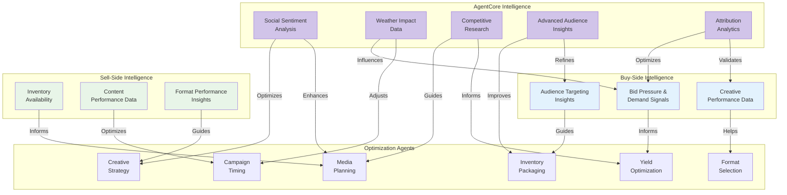
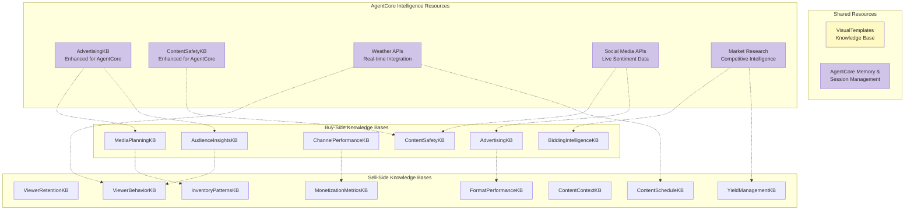
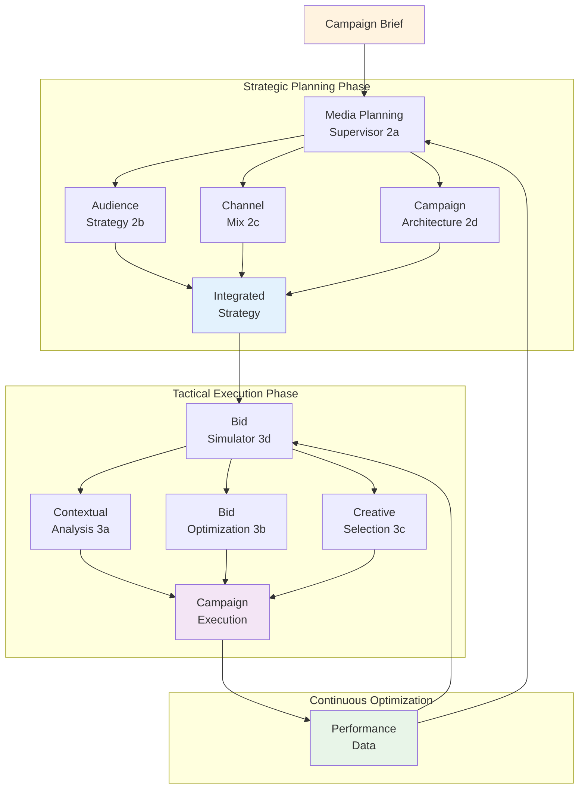
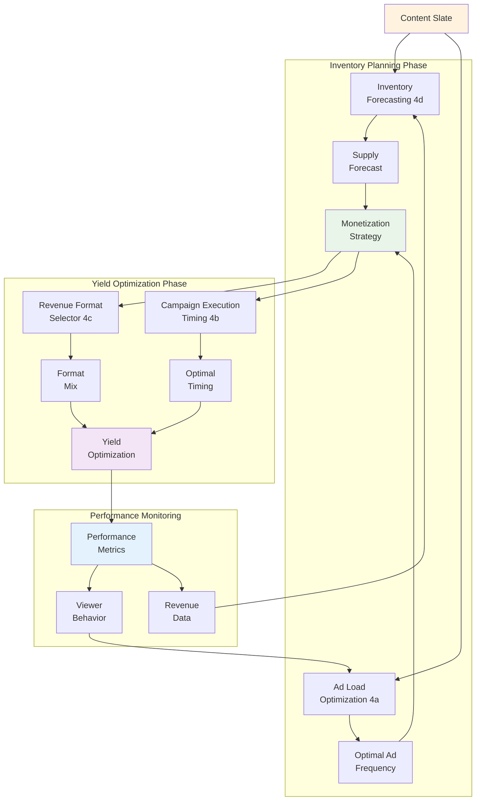
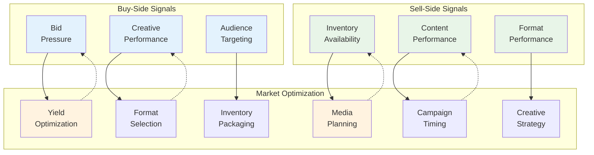
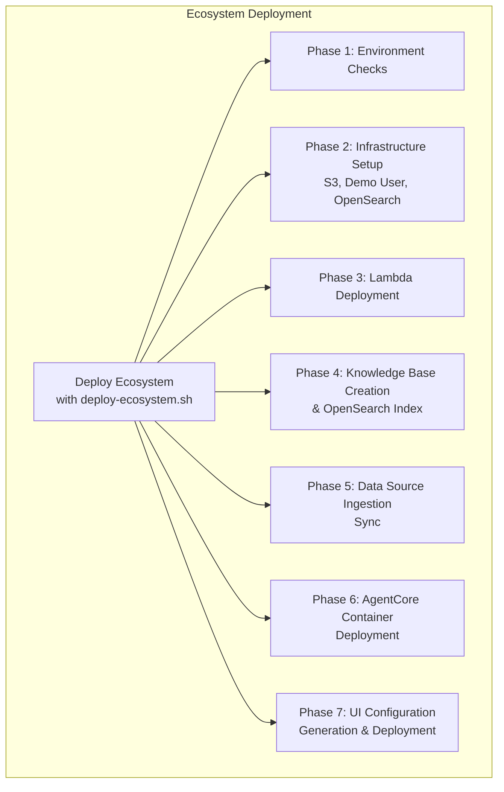

# Complete Agent Ecosystem Overview

## Executive Summary

This document provides a comprehensive overview of the complete AI agent ecosystem for advertising campaign planning and optimization. The system consists of **4 orchestrator agents** and **17 specialist agents** deployed in Amazon Bedrock AgentCore containerized runtime, creating an end-to-end solution spanning **Media Planning**, **Campaign Optimization**, **Publisher Monetization**, and **Inventory Management**. All agents run on **Amazon Bedrock AgentCore** runtime, providing enhanced capabilities including persistent memory, multi-agent orchestration, and direct knowledge base access.

## Architecture Overview

### High-Level Ecosystem Structure

**All agents now run on Amazon Bedrock AgentCore** - a container-based runtime providing:
- **Persistent Memory**: Session-aware conversation continuity
- **Advanced Orchestration**: Multi-agent coordination with Agent-to-Agent (A2A) protocol compatibility
- **External Integrations**: Real-time API access (weather, social media, market data)
- **Custom Logic**: Sophisticated business logic and specialized tools
- **Scalable Deployment**: Container-based infrastructure with auto-scaling

```mermaid
graph TD
    subgraph EXT["EXTERNAL INTEGRATIONS"]
        EXT1["Weather APIs"]
        EXT2["Social Media APIs"]
        EXT3["Market Data"]
    end
    
    subgraph KB["KNOWLEDGE BASE LAYER"]
        KB1["Advertising KB"]
    end
    
    subgraph RUNTIME["AGENTCORE RUNTIME LAYER"]
        subgraph MP_ECO["Media Planning Ecosystem"]
            MP["MediaPlanningAgent<br/>Strategic Orchestrator"]
            MP_AI["AudienceIntelligenceAgent<br/>Consumer Insights"]
            MP_FS["FormatStrategyOptimizerAgent<br/>Format Selection"]
            MP_TS["TimingStrategyAgent<br/>Campaign Timing"]
            
            MP --> MP_AI
            MP --> MP_FS
            MP --> MP_TS
        end
        
        subgraph CO_ECO["Campaign Optimization Ecosystem"]
            CO["CampaignOptimizationAgent<br/>Campaign Orchestrator"]
            CO_AS["AudienceStrategyAgent<br/>Targeting Strategy"]
            CO_CM["ChannelMixOptimizationAgent<br/>Budget Allocation"]
            CO_CA["CampaignArchitectureAgent<br/>Structure Design"]
            CO_CS["CreativeSelectionAgent<br/>Creative Optimization"]
            
            CO --> CO_AS
            CO --> CO_CM
            CO --> CO_CA
            CO --> CO_CS
            CO --> MP_TS
        end
        
        subgraph PUB_ECO["Publisher Monetization Ecosystem"]
            YO["YieldOptimizationAgent<br/>Revenue Optimization"]
            IO["InventoryOptimizationAgent<br/>Supply Management"]
            AL["AdLoadOptimizationAgent<br/>Viewer Experience"]
            
            YO --> MP_FS
            YO --> MP_TS
            YO --> MP_AI
            IO --> MP_TS
            IO --> MP_FS
        end
        
        subgraph ADV_ECO["Advanced Analytics Ecosystem"]
            WI["WeatherImpactAgent<br/>Climate Analysis"]
            SS["SocialSentimentAgent<br/>Brand Perception"]
            MA["MeasurementAgent<br/>Attribution Analytics"]
        end
    end
    
    MP -.-> KB1
    MP_AI -.-> KB1
    CO -.-> KB1
    CO_AS -.-> KB1
    CO_CM -.-> KB1
    CO_CA -.-> KB1
    CO_CS -.-> KB1
    MP_FS -.-> KB1
    MP_TS -.-> KB1
    AL -.-> KB1
    YO -.-> KB1
    IO -.-> KB1
    
    WI -.-> EXT1
    SS -.-> EXT2
    MA -.-> EXT3
    
    style MP fill:#41205B,color:#fff
    style CO fill:#AB5209,color:#fff
    style YO fill:#AE427B,color:#fff
    style IO fill:#E63387,color:#fff
    style WI fill:#d1c4e9
    style SS fill:#d1c4e9
    style MA fill:#d1c4e9
```

### AgentCore Agent Hierarchy

**All agents are now containerized AgentCore agents** with enhanced capabilities:

```mermaid
graph TD
    subgraph MP_SYS["Media Planning Ecosystem"]
        direction TB
        MP["MediaPlanningAgent<br/>ORCHESTRATOR<br/>AgentCore"]
        MP_AI["AudienceIntelligenceAgent<br/>TOOL AGENT<br/>AgentCore"]
        MP_FS["FormatStrategyOptimizerAgent<br/>TOOL AGENT<br/>AgentCore"]
        MP_TS["TimingStrategyAgent<br/>TOOL AGENT<br/>AgentCore"]
        
        MP --> MP_AI
        MP --> MP_FS
        MP --> MP_TS
    end
    
    subgraph CO_SYS["Campaign Optimization Ecosystem"]
        direction TB
        CO["CampaignOptimizationAgent<br/>ORCHESTRATOR<br/>AgentCore"]
        CO_AS["AudienceStrategyAgent<br/>TOOL AGENT<br/>AgentCore"]
        CO_CM["ChannelMixOptimizationAgent<br/>TOOL AGENT<br/>AgentCore"]
        CO_CA["CampaignArchitectureAgent<br/>TOOL AGENT<br/>AgentCore"]
        CO_CS["CreativeSelectionAgent<br/>TOOL AGENT<br/>AgentCore"]
        
        CO --> CO_AS
        CO --> CO_CM
        CO --> CO_CA
        CO --> CO_CS
        CO --> MP_TS
    end
    
    subgraph PUB_SYS["Publisher Monetization Ecosystem"]
        direction TB
        YO["YieldOptimizationAgent<br/>ORCHESTRATOR<br/>AgentCore"]
        IO["InventoryOptimizationAgent<br/>ORCHESTRATOR<br/>AgentCore"]
        AL["AdLoadOptimizationAgent<br/>STANDALONE<br/>AgentCore"]
        
        YO --> MP_FS
        YO --> MP_TS
        YO --> MP_AI
        IO --> MP_TS
        IO --> MP_FS
    end
    
    subgraph ADV_SYS["Advanced Analytics Ecosystem"]
        direction TB
        WI["WeatherImpactAgent<br/>STANDALONE<br/>AgentCore + External APIs"]
        SS["SocialSentimentAgent<br/>STANDALONE<br/>AgentCore + External APIs"]
        MA["MeasurementAgent<br/>STANDALONE<br/>AgentCore"]
    end
    
    style MP fill:#41205B,color:#fff
    style CO fill:#AB5209,color:#fff
    style YO fill:#AE427B,color:#fff
    style IO fill:#E63387,color:#fff
    style MP_AI fill:#804294,color:#fff
    style MP_FS fill:#F56F02,color:#fff
    style MP_TS fill:#E63387,color:#fff
    style CO_AS fill:#41205B,color:#fff
    style CO_CM fill:#804294,color:#fff
    style CO_CA fill:#845195,color:#fff
    style CO_CS fill:#AE427B,color:#fff
    style AL fill:#E63387,color:#fff
    style WI fill:#d1c4e9
    style SS fill:#d1c4e9
    style MA fill:#d1c4e9
```

## Orchestrator Agents Layer

### Media Planning Agent
**Role:** Strategic orchestrator of comprehensive sell-side media planning
**Team:** Publisher Revenue Operations

**Core Capabilities:**
- Maximizes revenue and inventory utilization through intelligent collaboration
- Develops strategic media plans from publisher perspective
- Optimizes inventory allocation across formats and timing
- Coordinates with Audience Intelligence, Timing Strategy, and Format Strategy specialists
- Provides revenue impact quantification and implementation roadmaps

**Knowledge Base:**
- Advertising

**Specialist Agents:**
- AudienceIntelligenceAgent
- TimingStrategyAgent
- FormatStrategyOptimizerAgent

**Model Configuration:**
- Orchestrator: Claude Sonnet 4 (12K tokens, temp 0.3)
- Specialists: Claude Sonnet 4 (8K tokens, temp 0.3)

**Key Use Cases:**
- "Develop strategic media plan for Q4 holiday season from publisher perspective"
- "Optimize inventory utilization and format mix for maximum yield"
- "Analyze advertiser-publisher value alignment for automotive campaign"

### Campaign Optimization Agent
**Role:** Comprehensive campaign planning specialist for agencies and advertisers
**Team:** Media Strategy & Planning

**Core Capabilities:**
- End-to-end campaign development from strategy to execution
- Orchestrates audience strategy, channel mix, campaign architecture, creative selection, and timing
- Balances brand awareness and performance objectives
- Integrated measurement frameworks and attribution planning
- Synthesizes insights from 5 specialist agents for holistic campaigns

**Knowledge Base:**
- Advertising

**Specialist Agents:**
- AudienceStrategyAgent
- ChannelMixOptimizationAgent
- CampaignArchitectureAgent
- CreativeSelectionAgent
- TimingStrategyAgent

**Model Configuration:**
- Orchestrator: Claude Sonnet 4 (12K tokens, temp 0.3)
- Specialists: Claude 3.7 Sonnet (8K tokens, temp 0.3)

**Key Use Cases:**
- "Create integrated campaign strategy for product launch with $1M budget"
- "Develop brand repositioning campaign targeting younger audience"
- "Balance brand awareness and performance objectives for e-commerce campaign"

### Yield Optimization Agent
**Role:** Revenue optimization and yield management specialist
**Team:** Ad Monetization Team

**Core Capabilities:**
- Maximizes publisher revenue through strategic pricing and inventory optimization
- Dynamic pricing models and floor price optimization
- Performance analytics and revenue forecasting
- Seasonal yield patterns and market timing optimization
- Coordinates with Audience Intelligence, Timing, and Format specialists

**Knowledge Base:**
- Advertising

**Specialist Agents:**
- AudienceIntelligenceAgent
- TimingStrategyAgent
- FormatStrategyOptimizerAgent

**Model Configuration:**
- Orchestrator: Claude Sonnet 4 (12K tokens, temp 0.3)
- Specialists: Claude 3.7 Sonnet (8K tokens, temp 0.3)

**Key Use Cases:**
- "Optimize yield for premium video inventory - current $12 CPM, target $18 CPM"
- "Analyze competitive yield positioning and recommend pricing strategies"
- "Develop seasonal yield optimization strategy for holiday shopping period"

### Inventory Optimization Agent
**Role:** Strategic orchestrator of inventory planning and yield optimization
**Team:** Supply & Demand Planning

**Core Capabilities:**
- Inventory availability forecasting and demand prediction
- Premium inventory identification and packaging strategies
- Seasonal and cyclical inventory pattern analysis
- Dynamic pricing and yield management
- Coordinates with Timing and Format specialists

**Knowledge Base:**
- Advertising

**Specialist Agents:**
- TimingStrategyAgent
- FormatStrategyOptimizerAgent

**Model Configuration:**
- Orchestrator: Claude Sonnet 4 (12K tokens, temp 0.3)
- Specialists: Claude 3.7 Sonnet (8K tokens, temp 0.3)

**Key Use Cases:**
- "Forecast inventory availability for Q1 2025 across all formats"
- "Identify premium inventory packaging opportunities for luxury advertisers"
- "Optimize inventory utilization and fill rate improvement strategies"

## Specialist Agents Layer

### Audience Intelligence Agent
**Role:** Consumer behavior analysis and audience segmentation specialist
**Team:** Consumer Insights & Analytics

**Core Capabilities:**
- Consumer demographic and psychographic profiling
- Digital behavior patterns and cross-device usage analysis
- Audience segmentation and targeting strategy development
- Consumer journey mapping and touchpoint optimization
- Privacy-compliant targeting recommendations

**Knowledge Base:**
- Advertising

**Model Configuration:**
- Claude Sonnet 4 (8K tokens, temp 0.3)

**Used By:**
- Media Planning Agent
- Yield Optimization Agent

**Key Use Cases:**
- "Analyze target audience segments for back-to-school campaign"
- "Map consumer journey for luxury product purchase"
- "Develop privacy-compliant targeting strategy"

### Audience Strategy Agent
**Role:** Advanced targeting strategy and persona development specialist
**Team:** Media Strategy & Planning

**Core Capabilities:**
- Sophisticated audience segmentation and persona development
- Consumer journey mapping with cross-device tracking
- Privacy-compliant targeting strategies and data activation
- Lookalike modeling and expansion opportunities
- Platform-specific audience capabilities and limitations

**Knowledge Base:**
- Advertising

**Model Configuration:**
- Claude 3.7 Sonnet (8K tokens, temp 0.3)

**Used By:**
- Campaign Optimization Agent

**Key Use Cases:**
- "Develop advanced audience segments for luxury brand campaign"
- "Optimize cross-device targeting strategy for better attribution"
- "Create lookalike audiences for customer acquisition"

### Timing Strategy Agent
**Role:** Campaign timing and pacing optimization specialist
**Team:** Execution Planning

**Core Capabilities:**
- Campaign launch timing and market readiness analysis
- Audience engagement patterns and peak activity windows
- Seasonal and cyclical performance optimization
- Budget pacing and spend optimization over time
- Event-driven and real-time campaign activation strategies

**Knowledge Base:**
- Advertising

**Model Configuration:**
- Claude Sonnet 4 or Claude 3.7 Sonnet (8K tokens, temp 0.3)

**Used By:**
- Media Planning Agent
- Campaign Optimization Agent
- Yield Optimization Agent
- Inventory Optimization Agent

**Key Use Cases:**
- "Determine optimal launch timing for holiday campaign"
- "Optimize budget pacing over campaign duration"
- "Coordinate timing across multiple platforms"

### Format Strategy Optimizer Agent
**Role:** Ad format optimization and revenue maximization specialist
**Team:** Format Performance

**Core Capabilities:**
- Ad format performance analysis and revenue optimization
- Content-format alignment and user experience impact
- Format mix strategies for yield maximization
- Cross-platform format performance comparison
- Premium format identification and pricing strategies

**Knowledge Base:**
- Advertising

**Model Configuration:**
- Claude Sonnet 4 or Claude 3.7 Sonnet (8K tokens, temp 0.3)

**Used By:**
- Media Planning Agent
- Yield Optimization Agent
- Inventory Optimization Agent

**Key Use Cases:**
- "Recommend optimal format mix for premium video content"
- "Analyze format performance by content type"
- "Optimize format sequencing for maximum yield"

### Channel Mix Optimization Agent
**Role:** Integrated media planning and channel strategy expert
**Team:** Media Strategy & Planning

**Core Capabilities:**
- Optimal budget allocation across channels
- Cross-channel synergy identification and lift analysis
- Reach and frequency modeling
- Competitive channel intelligence
- Attribution-based channel optimization

**Knowledge Base:**
- Advertising

**Model Configuration:**
- Claude 3.7 Sonnet (8K tokens, temp 0.3)

**Used By:**
- Campaign Optimization Agent

**Key Use Cases:**
- "Allocate $500K budget across digital channels"
- "Identify cross-channel synergies for brand campaign"
- "Optimize channel mix for maximum reach efficiency"

### Campaign Architecture Agent
**Role:** Campaign structure and measurement framework specialist
**Team:** Media Strategy & Planning

**Core Capabilities:**
- Campaign hierarchy design and naming conventions
- Measurement framework development and attribution planning
- Implementation timeline planning with dependencies
- Quality assurance and optimization protocols
- Budget pacing and allocation strategies

**Knowledge Base:**
- Advertising

**Model Configuration:**
- Claude 3.7 Sonnet (8K tokens, temp 0.3)

**Used By:**
- Campaign Optimization Agent

**Key Use Cases:**
- "Design campaign structure for multi-product launch"
- "Develop measurement framework for omnichannel campaign"
- "Create implementation timeline with optimization milestones"

### Creative Selection Agent
**Role:** Creative strategy and optimization specialist
**Team:** Creative Performance

**Core Capabilities:**
- Creative-audience alignment optimization
- Asset optimization and testing strategies
- Brand consistency and message architecture
- Performance-driven creative recommendations
- Creative fatigue management and rotation strategies

**Knowledge Base:**
- Advertising

**Model Configuration:**
- Claude 3.7 Sonnet (8K tokens, temp 0.3)

**Used By:**
- Campaign Optimization Agent

**Key Use Cases:**
- "Recommend creative strategy for target audience"
- "Optimize creative rotation to prevent fatigue"
- "Align creative messaging with audience segments"

### Ad Load Optimization Agent
**Role:** Viewer retention and revenue balance specialist
**Team:** Consumer Insights & Analytics

**Core Capabilities:**
- Balances advertising revenue with viewer experience
- Analyzes viewer engagement patterns and tolerance thresholds
- Optimizes ad frequency and placement strategies
- Content-specific ad load recommendations
- Sustainable monetization strategies

**Knowledge Base:**
- Advertising

**Model Configuration:**
- Claude Sonnet 4 (8K tokens, temp 0.3)

**Used By:**
- Standalone agent (can be invoked directly)

**Key Use Cases:**
- "Optimize ad load for premium streaming content"
- "Balance revenue maximization with viewer retention"
- "Analyze viewer tolerance by content genre"

### Media Plan Compiler Agent
**Role:** Strategic synthesis and plan compilation specialist
**Team:** Publisher Revenue Operations

**Core Capabilities:**
- Synthesizes insights from multiple specialist agents
- Compiles comprehensive media plans
- Strategic recommendation integration
- Implementation roadmap development
- Performance projection consolidation

**Knowledge Base:**
- Advertising

**Model Configuration:**
- Claude 3.7 Sonnet (8K tokens, temp 0.3)

**Used By:**
- Media Planning Agent (for final plan compilation)

**Key Use Cases:**
- "Compile comprehensive media plan from specialist insights"
- "Synthesize strategic recommendations into actionable plan"
- "Create unified implementation roadmap"

## Data Flow & Integration Patterns

### Cross-Ecosystem Data Exchange

### Knowledge Base Interconnections

## Integration Workflow

### Buy-Side Workflow (Advertiser/Agency)

### Sell-Side Workflow (Publisher/Platform)

### Cross-Ecosystem Integration

## Knowledge Base Architecture

### One Knowledge Base with Single Data Source

The ecosystem uses **1 Knowledge Base** named "Advertising" with **1 comprehensive data source** that covers all advertising intelligence domains:

**Single Data Source: AdvertisingData**
- Covers all data under the `advertising-data/` prefix in S3
- Includes the following data categories:
  - **Audience Insights**: Audience segmentation, social sentiment, targeting strategies, viewer behavior
  - **Campaign Intelligence**: Media planning frameworks and strategic guidance
  - **Content Safety**: Brand safety rules, domain categorization, format context, safety rules, scheduling data
  - **Performance Analytics**: Audience performance, bidding intelligence, campaign data, channel performance, creative performance
  - **Monetization**: Inventory-yield data including demand patterns, inventory forecasting, pricing models, supply availability

**Used By All Agents:**
- Media Planning Agent, Campaign Optimization Agent, Yield Optimization Agent, Inventory Optimization Agent
- Audience Intelligence Agent, Audience Strategy Agent, Timing Strategy Agent, Format Strategy Optimizer Agent
- Channel Mix Optimization Agent, Campaign Architecture Agent, Creative Selection Agent
- Ad Load Optimization Agent, Media Plan Compiler, Weather Impact Agent, Current Events Agent

### Knowledge Base Benefits

**Logical Data Grouping:**
- Related data sources consolidated for better context
- Reduced cross-KB searches with focused data organization
- Improved query efficiency and response accuracy

**Agent-Specific Access:**
- Each agent accesses only relevant knowledge bases
- Optimized vector search performance
- Reduced token consumption and latency

**Scalable Design:**
- Easy to add new data sources within existing KBs
- Simple to onboard new agents with KB associations
- Flexible architecture for future enhancements

### Shared Resources
- **VisualTemplates:** Standardized visualization schemas for consistent UI rendering across all agents
- **AgentCore Memory Architecture:** Persistent memory and session management for enhanced context retention across all agent interactions

## File Analysis Capabilities

All agents can analyze multiple file types, including: TXT, CSV, JSON, PowerPoint, Word, PDF, and PNG or JPEG images. The system only supports attaching one file at a time to a prompt.

### Buy-Side File Analysis

**Strategic Planning Files:**
- Campaign Briefs (PDF, Word)
- Market Research (PDF, Excel)
- Historical Performance Data (CSV, Excel)
- Budget Documents (Excel, PDF)
- Brand Guidelines (PDF)

**Tactical Execution Files:**
- Performance Reports (CSV, Excel)
- Creative Assets (PDF, Images)
- Bid History Data (CSV, JSON)
- Publisher Lists (CSV, Excel)
- Analytics Reports (PDF, CSV)

### Sell-Side File Analysis

**Publisher Monetization Files:**
- Viewer Analytics Reports (CSV, Excel): Watch time, completion rates, drop-off analysis
- Revenue Reports (CSV, JSON): CPM data, fill rates, revenue per viewer hour
- Content Performance (Excel, CSV): Genre-specific metrics, series completion data
- Viewing Pattern Data (CSV, Excel): Hour-by-hour trends, peak times, device usage
- Content Release Schedules (CSV, JSON): Premiere dates, episode drops, special events
- Format Performance Reports (CSV, Excel): Completion rates, interaction metrics
- Historical Viewing Data (CSV, Excel): Past impression volumes, seasonal trends
- Pricing History (CSV, Excel): CPM trends, floor price performance

### AgentCore Intelligence File Analysis

**Social Sentiment Analysis Files:**
- Social Media Export Data (JSON, CSV): Platform-specific engagement metrics, sentiment scores
- Brand Mention Reports (CSV, Excel): Mention volume, sentiment distribution, influencer impact
- Crisis Management Reports (PDF, Excel): Reputation risk assessments, response effectiveness
- Competitive Sentiment Analysis (CSV, JSON): Comparative brand perception data

**Weather Impact Analysis Files:**
- Weather Forecast Data (JSON, XML): Real-time and historical weather patterns
- Location-Based Analytics (CSV, Excel): Geographic performance correlations with weather
- Seasonal Campaign Performance (Excel, CSV): Weather-driven campaign effectiveness data

**Competitive Market Research Files:**
- Market Research Reports (PDF, Excel): Industry analysis, competitive positioning
- Advertising Spend Data (CSV, Excel): Competitive budget allocation and channel mix
- Industry Trend Analysis (PDF, JSON): Emerging technology and market shift reports
- Competitive Campaign Analysis (Excel, CSV): Campaign performance benchmarking

**Advanced Audience Strategy Files:**
- Customer Journey Data (JSON, CSV): Cross-device and cross-platform behavior tracking
- Lookalike Modeling Data (CSV, Excel): Audience expansion and similarity scoring
- Privacy-Compliant Targeting Data (JSON, CSV): Consent-based audience segments
- Cross-Platform Attribution Data (CSV, Excel): Multi-touchpoint conversion analysis

**Measurement & Attribution Files:**
- Multi-Touch Attribution Reports (CSV, Excel): Cross-channel conversion path analysis
- Incrementality Test Results (Excel, CSV): Lift measurement and holdout group analysis
- Marketing Mix Modeling Data (CSV, Excel): Channel contribution and saturation curves
- Custom Attribution Model Data (JSON, CSV): Algorithm performance and optimization metrics

## Visualization Integration

All agents use standardized visualization templates from the VisualTemplates knowledge base:

### Standard Visualization Templates (AgentCore)
- **allocations-visualization:** Budget distribution and investment allocation
- **channels-visualization:** Channel performance and strategy analysis
- **segments-visualization:** Audience segment analysis and targeting
- **timeline-visualization:** Implementation phases and optimization schedules
- **metrics-visualization:** Performance metrics and KPI dashboards
- **decision-tree-visualization:** Strategic scenarios and trade-off analysis
- **creative-visualization:** Generated creative assets and variations

### AgentCore-Enhanced Visualizations

**Social Sentiment Visualizations:**
- **metrics-visualization:** Real-time sentiment scores, brand perception metrics, engagement quality analysis
- **segments-visualization:** Sentiment-based audience segments, advocacy vs. detractor analysis
- **timeline-visualization:** Sentiment trend analysis, campaign impact on brand perception over time

**Weather Impact Visualizations:**
- **metrics-visualization:** Weather impact metrics on audience behavior and campaign performance
- **segments-visualization:** Weather-responsive audience segments and behavioral cohorts
- **timeline-visualization:** Weather forecast integration with campaign optimization schedules

**Competitive Research Visualizations:**
- **metrics-visualization:** Market share analysis, competitive performance benchmarking
- **allocations-visualization:** Competitive budget allocation insights and market investment strategies
- **segments-visualization:** Competitive landscape segmentation and market positioning
- **channels-visualization:** Competitive channel strategy analysis and market presence
- **timeline-visualization:** Competitive campaign timelines and market trend analysis

**Advanced Audience Strategy Visualizations:**
- **segments-visualization:** Sophisticated audience segmentation with behavioral and predictive modeling
- **timeline-visualization:** Consumer journey mapping with cross-device touchpoint analysis
- **metrics-visualization:** Advanced audience performance metrics, lookalike modeling effectiveness

**Measurement & Attribution Visualizations:**
- **metrics-visualization:** Multi-touch attribution performance, incrementality test results
- **allocations-visualization:** Attribution-based budget allocation recommendations
- **timeline-visualization:** Attribution model performance over time, optimization schedules

### AgentCore Visualization Capabilities

**Enhanced Interactivity:**
- Real-time data updates from external APIs (weather, social media)
- Dynamic visualization adaptation based on live data feeds
- Multi-agent collaboration visualization showing cross-agent insights

**Advanced Analytics Display:**
- Machine learning model performance visualization
- Predictive analytics confidence intervals and scenario modeling
- Cross-platform attribution flow diagrams and conversion path analysis

## Key Differentiators

### Buy-Side Advantages

**Strategic Layer (Media Planning):**
- **Comprehensive Planning:** End-to-end media strategy development
- **Cross-Channel Optimization:** Integrated approach across all channels
- **Data-Driven Decisions:** MMM and attribution-based recommendations
- **Scalable Frameworks:** Structures that grow with campaign complexity

**Tactical Layer (RTB Optimization):**
- **RTB Strategy Optimization:** Suggested bid and creative adjustments
- **Brand Safety Focus:** Comprehensive content and publisher evaluation
- **Performance Maximization:** Continuous optimization for efficiency
- **Creative Innovation:** AI-powered asset generation and testing

### Sell-Side Advantages

**Publisher Monetization Layer:**
- **Viewer-Centric Optimization:** Balances revenue with viewer experience
- **Content-Aware Strategies:** Format and timing aligned with content characteristics
- **Predictive Intelligence:** Accurate inventory forecasting and demand prediction
- **Yield Maximization:** Dynamic pricing and format optimization for premium CPMs
- **Collaborative Intelligence:** Multi-agent coordination for comprehensive optimization

### AgentCore Intelligence Advantages

**Advanced Analytics Layer:**
- **Real-Time Intelligence:** Live data integration from weather, social media, and market sources
- **Predictive Modeling:** Advanced machine learning capabilities for audience behavior and market trend prediction
- **Multi-Agent Coordination:** Sophisticated collaboration between specialized intelligence agents
- **Memory & Learning:** Persistent memory capabilities for continuous improvement and context retention

**Enhanced Decision Making:**
- **Sentiment-Driven Optimization:** Real-time brand perception analysis for campaign adjustments
- **Weather-Responsive Campaigns:** Dynamic optimization based on environmental factors and behavioral impacts
- **Competitive Intelligence:** Market analysis for strategic positioning and opportunity identification
- **Advanced Attribution:** Multi-touch attribution modeling for accurate performance measurement

### Integrated Ecosystem Benefits

**Complete Market Coverage:**
- **Buy-Side to Sell-Side:** Strategic planning flows through tactical execution to publisher optimization
- **Cross-Market Intelligence:** Demand signals inform supply optimization and vice versa
- **Unified Learning:** Performance data improves both advertiser and publisher strategies
- **Intelligence Layer Enhancement:** AgentCore agents provide advanced analytics and real-time insights across all layers

**Ecosystem Synergies:**
- **Demand-Supply Balance:** Buy-side demand signals optimize sell-side yield strategies
- **Content-Creative Alignment:** Publisher content insights inform advertiser creative strategies
- **Market Efficiency:** Coordinated optimization across the entire advertising value chain
- **Intelligence Amplification:** AgentCore agents enhance decision-making across all traditional agents
- **Real-Time Adaptation:** Live data feeds enable dynamic campaign optimization and market responsiveness

## Implementation Considerations

### Deployment Sequence

### Success Metrics

**Buy-Side Success Metrics:**
- **Strategic Accuracy:** Alignment between planned and actual performance
- **Tactical Efficiency:** Improvement in bid performance and creative effectiveness
- **Cross-Layer Integration:** Seamless handoff between strategic and tactical layers
- **User Adoption:** Ease of use and value delivery for campaign managers

**Sell-Side Success Metrics:**
- **Revenue Optimization:** Increase in overall yield and CPM performance
- **Viewer Retention:** Maintained or improved engagement despite monetization
- **Inventory Efficiency:** Improved fill rates and reduced under-delivery
- **Format Performance:** Enhanced ad format effectiveness and completion rates

**Cross-Ecosystem Success Metrics:**
- **Market Efficiency:** Improved matching between advertiser demand and publisher supply
- **Data Integration:** Seamless flow of insights between buy-side and sell-side agents
- **Collaborative Intelligence:** Enhanced performance through multi-agent coordination

**AgentCore Intelligence Success Metrics:**
- **Real-Time Responsiveness:** Speed and accuracy of live data integration and analysis
- **Predictive Accuracy:** Precision of weather, sentiment, and market trend predictions
- **Memory Effectiveness:** Quality of context retention and learning across sessions
- **API Integration Reliability:** Uptime and data quality from external integrations
- **Advanced Analytics Impact:** Measurable improvement in campaign performance through AgentCore insights

## Future Enhancements

### Potential Expansions

**Cross-Ecosystem Integration:**
- **Real-Time Market Matching:** Direct integration between buy-side demand and sell-side supply
- **Advanced Attribution:** Cross-device and offline conversion modeling spanning both ecosystems
- **Predictive Market Intelligence:** Trend forecasting that benefits both advertisers and publishers
- **Automated Execution:** Direct platform integration for hands-off optimization across the value chain

**Specialized Agent Extensions:**
- **Fraud Detection Agents:** Cross-ecosystem fraud prevention and quality assurance
- **Privacy Compliance Agents:** Automated privacy regulation compliance across all agents
- **Performance Attribution Agents:** Advanced multi-touch attribution spanning buy-side and sell-side (partially implemented via AgentCore Measurement Agent)
- **Market Intelligence Agents:** Competitive analysis and trend prediction for both ecosystems (implemented via AgentCore Competitive Research Agent)

**AgentCore Platform Enhancements:**
- **Multi-Modal Intelligence:** Integration of text, image, and video analysis capabilities
- **Advanced Memory Systems:** Enhanced long-term memory and cross-session learning
- **Real-Time Collaboration:** Improved multi-agent coordination and intelligence sharing
- **External Data Ecosystem:** Expanded integration with industry data sources and APIs

### Continuous Improvement

**Knowledge Base Evolution:**
- **Cross-Ecosystem Data Sharing:** Enhanced insights from combined buy-side and sell-side data
- **Real-Time Learning:** Continuous model updates from live campaign and monetization performance
- **Market Intelligence Integration:** External data sources for comprehensive market understanding

**Agent Capability Enhancement:**
- **Advanced Collaboration:** More sophisticated multi-agent coordination patterns (enhanced by AgentCore memory and session management)
- **Predictive Modeling:** Enhanced forecasting capabilities across all agent types (implemented via AgentCore advanced analytics)
- **Automated Optimization:** Reduced human intervention through intelligent automation
- **Performance Optimization:** Improved accuracy, speed, and resource efficiency

**Ecosystem Maturation:**
- **Industry Standards:** Development of standardized practices for AI-driven advertising
- **Platform Integration:** Native integration with major advertising and publishing platforms
- **Regulatory Compliance:** Built-in compliance with evolving privacy and advertising regulations
- **Global Expansion:** Localization for different markets and regulatory environments

---

## Technology Architecture Summary

### Hybrid Agent Deployment Model

This ecosystem leverages **Amazon Bedrock AgentCore** to create a comprehensive advertising intelligence platform:

- Strategic planning and tactical execution agents (2x, 3x, 4x series)
- Reliable, scalable, and cost-effective for standard workflows
- Integrated with knowledge bases and action groups
- Optimized for consistent, repeatable tasks
- Advanced intelligence and analytics agents (5x series)
- Enhanced memory capabilities and session management
- Real-time external API integrations
- Sophisticated multi-agent coordination and research capabilities